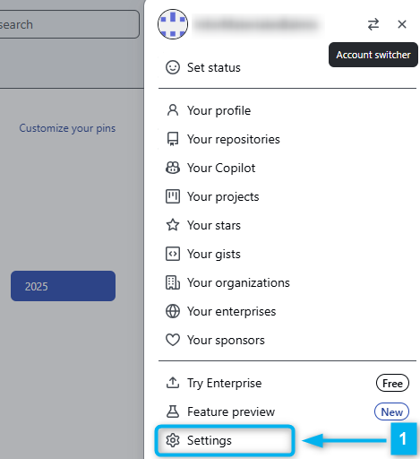

---
title:
    Manual Generar Repositorio
date: 16/06/2021
export_on_save:
    puppeteer: true
    html: true
puppeteer:
    scale: 1
    landscape: false
    format: "A4"
    printBackground: true
    margin:
        top: "1cm"
        right: "1cm"
        bottom: "2.5cm"
        left: "1cm"
    displayHeaderFooter: true
    headerTemplate: "&nbsp;"
    footerTemplate: "
        <span style=\"font-size: 9pt; display: flex;\">
            <span class=\"pageNumber\" style=\"margin-left: 1cm;\"></span>
            /
            <span class=\"totalPages\"></span>
            <span class=\"title\" style=\"margin-left: 1cm;\"></span>
            <span style=\"margin-left: 1cm;\">Departamento de Informática IES Doctor Balmis</span>
        </span>
                    "
toc:
    depth_from: 1
    depth_to: 4
    ordered: false
---

# Manual para crear el marco de trabajo {ignore=true}

[Descargar estos apuntes](./manual_crear_repositorio.pdf)

## Índice {ignore=true}

[TOC]

<div style="page-break-after:always;"></div>

## Pre-Requisitos

1. Tener una **cuenta de GitHub**.
2. Tener instalado **Google Chrome** en el equipo.
3. Tener instalado **[Git](https://git-scm.com/download/win)** en local. **Si es la primera vez que trabajas con git**, deberás configurar tu nombre y correo electrónico. Para ello, puedes usar el siguiente comando en la terminal de Windows o Git Bash:

   ```cmd
   C:\materiales> git config --global user.name "Nombre Apellido"
   C:\materiales> git config --global user.email "cuenta@iesdoctorbalmis.com"
   ```

4. Tener el Java Runtime instalado mínimo la versión 17.
5. Tener instalado **[Visual Studio Code](https://code.visualstudio.com/)**. Puedes descargar la versión portable ya preparada de **[GDrive](https://drive.google.com/drive/u/0/folders/1LaryOjKFO4osOZkenHwuBcZ4U7rH1Gan)** en la carpeta del Departamento.

    Si ya lo tienes instalado puedes crearte un perfil personalizado de "***Apuntes con Markdown***" con las siguientes extensiones:

      * **Spanish Language Pack for VSCode** (para traducir el IDE al español)
      * **Code Spell Checker** (para detectar corrección ortográfica y sintáctica en  textos)
      * ***Spanish - Code Spell Checker*** (paquete de idioma español para el corrector ortográfico)
      * **Open in browser** (para abrir un archivo HTML en el navegador con botón derecho)
      * **Markdown All in One** (para trabajar con archivos markdown)
      * **Markdown Preview Enhanced** (para visualizar el archivo .md)
      * **markdownlint** (para comprobar el contenido del archivo)
      * **PlauntUML** (para mostrar colores en bloques de código de diagramas)
      * Visual Studio Keymap (para usar los atajos de teclado de Visual Studio)

### Esquema de carpetas tras la instalación

<div class="row">
<div class="col-sm-7">

En la capeta **`[data]`** está la configuración local del usuario de VSCode, en la carpeta **`[extensions]`** están las extensiones instaladas y en la carpeta descritas en el punto anterior y en la carpeta **`[user-data]`** está la configuración global del usuario de VSCode como pueden ser los snippets, temas, configuraciones de usuario, etc.

</div>
<div class="col-sm-5">


</div>
</div>

En la carpeta **`[jar]`** está el ejecutable de PlantUML que markdown-preview-enhanced utiliza para renderizar los diagramas, ya está preconfigurado en la instalación portable, pero para funcionar necesitarás tener el JRE de Java instalado como se comentaba anteriormente.

<div style="page-break-after:always;"></div>

## Creación del Workspace

Se ha creado una cuenta de GitHub para el departamento de informática del IES Doctor Balmis, para gestionar los repositorios con materiales para los módulos de Digitalización y Sosténibilidad. La cuenta es **`infor.materiales@iesdoctorbalmis.com`** y la clave de acceso es la usar de forma tradicional en el departamento para administración.

!!! warning Aviso
    Esta cuenta es solo para labores administrativas y no se debe usar para trabajos personales. Por lo que para acceder o clonar los repositorios de trabajo hay que usar la cuenta personar de GitHub y si no se tiene acceso a alguna organización dependiente de esta cuenta. Podemos usar esta cuenta para añadirnos como colaboradores en la mismas.

Partir de la **plantilla** de trabajo que se ha creado para el departamento. Para ello, deberemos seguir los siguientes pasos:

1. En el siguiente **[repositorio público de GitHub](https://github.com/InforMaterialesBalmis/plantillamd)**, debes clonar el repositorio en tu equipo local. Pude que te pida autenticación de acceso a GitHub por lo que te aparecerá una autenticación inicial que te generará una credenciales de acceso desde tu equipo local. Para ello, puedes usar el siguiente comando en la terminal de Windows o Git Bash:

   ```cmd
   C:\materiales> git clone https://github.com/InforMaterialesBalmis/plantillamd.git
   ```

   Si no sabes obtener la URL del repositorio para usarla con el comando **`clone`**, puedes hacerlo desde el botón **`Code`** :one: y al desplegar te aparecerá la URL que debes copiar con el botón de **`Copy to Clipboard`** :two:. Así para cualquier repositorio que quieras clonar.

   { style="display:block;margin:0 auto;max-width:600px;" }


2. Una vez clonado el repositorio, debes entrar en la carpeta **`plantilla`** que habrá creado y borrar la carpeta **`.git`** que se ha creado al clonar el repositorio. Para ello, puedes usar el siguiente comando en la terminal de Windows o Git Bash:

   ```cmd
   C:\materiales> cd plantillamd
   C:\materiales\plantillamd>
   C:\materiales\plantillamd> del /s /q .git
   ```

3. Usando la cuenta **`infor.materiales@iesdoctorbalmis.com`** creamos una nueva organización en GitHub. Para ello, desplegamos el menú de la derecha pulsando sobre el avatar y seleccionamos **`Settings`** :one:, en settings seleccionamos **`Organizations`** :two: y pulsamos sobre el botón **`New organization`** :three:. En nuestros ejemplos, hemos creado la organización **balmisdigigs** :four:, pero **puedes poner un nombre identificativo de tu módulo como y nivel**.

    <div class="row">
    <div class="col-sm-6 d-flex justify-content-center">

    {height=300}

    </div>
    <div class="col-sm-6 d-flex justify-content-center">

    {height=300}

    </div>
    <div class="col-sm-12 d-flex justify-content-center">

    {height=300}

    </div>
    </div>

4. Una vez tenemos la organización creada accedemos a la misma a través de la pantalla anterior y lo primero que revisaremos es los colaboradores (**`People`** :one:) que van a tener acceso a sus repos privados y los permisos que tendrán. Posteriormente, vamos a la pestaña de **`Repositories`** :two: y pulsamos sobre el botón **`New Repository`**para crear un nuevo repositorio.
    * :three: Creamos un repositorio **privado** con un archivo **`README.md`** para que así tenga un primer commit y llámalo con un nombre indicativo de tus materiales. En nuestro ejemplo le hemos llamado **`digitalizacion`**.
    * :four: Creamos un repositorio **público** para el despliegue de nuestro contenido en GitHub Pages. En nuestro ejemplo le hemos llamado **`digitalizacion.github.io`**.
        > :pushpin: **Nota**: Posteriomente volveremos a él para configurar la publicación en **GitHub Pages**.
  
    { style="display:block;margin:0 auto;max-width:600px;" }

5. Vamos a pasar los contenidos de la plantilla al repositorio que acabamos de crear, para ello volvemos a la carpeta **`C:\materiales`** en el CMD y clonamos el repositorio privado que hemos creado en la organización seguimos los siguientes pasos que puedes ver en el ejemplo:

   1. Lo clonamos en la carpeta **`C:\materiales`**.

        ```cmd
        C:\materiales> git clone https://github.com/balmisdigigs/digitalizacion.git
        ```

   2. Entramos en la carpeta del repositorio clonado **`digitalizacion`**, copiamos el contenido de la **`plantillamd`** a la carpeta del repositorio clonado y por último borramos la carpeta **`plantillamd`** que hemos clonado inicialmente. Para ello, puedes usar los siguientes comandos en la terminal de Windows...

        ```cmd
        C:\materiales> cd digitalizacion
        C:\materiales\digitalizacion> copy /s /q ..\plantillamd\* .
        C:\materiales\digitalizacion> del /s /q ..\plantillamd
        ```

   3. Hacemos un primer commit con el contenido de la plantilla y lo subimos a GitHub. Para ello, puedes usar los siguientes comandos en la terminal de Windows...

        ```cmd
        C:\materiales\digitalizacion> git add .
        C:\materiales\digitalizacion> git commit -m "Primer commit con la plantilla"
        C:\materiales\digitalizacion> git push
        ```

   4. Creamos una rama con nuestro nombre y la subimos a GitHub. Para ello, puedes usar los siguientes comandos en la terminal de Windows...

        ```cmd
        C:\materiales\digitalizacion> git branch profesorx
        C:\materiales\digitalizacion> git checkout profesorx
        C:\materiales\digitalizacion> git push -u origin profesorx
        ```

<div style="page-break-after:always;"></div>

## Configuración de la publicación

### Configurar token para desplegar en Pages

{ style="display:block;margin:0 auto;max-width:600px;" }

* :one: Como hicimos al principio, saliendo de cualquier organización, vamos a la **`configuración`** (**`Settings`**) de nuestra cuenta y vamos a la sección de **`Developer settings`** que es la última del menú de la izquierda.
* :two: En la sección de **`Personal access tokens`** pulsamos sobre el botón **`Tokens (classic)`**.
* :three: Pulsamos sobre el botón **`Generate new token`** y rellenamos los siguientes campos:

  * **`Note`**: Nombre del token, por ejemplo **`DEPLOY_GH_KEY`** (Deploy GitHub Key).
  * **`Expiration`**: Seleccionamos **No expiration** para que no caduque nunca.
  * **`Select scopes`**: Marcamos las siguientes opciones:
    * **repo** (Full control of private repositories)
    * **workflow** (Update GitHub Action workflow files)

    Nada más generarlo, **lo copiaremos y lo guardaremos en un lugar seguro**, ya que no podremos volver a verlo. Si lo perdemos tendremos que borrar el token y crear uno nuevo.

* :four: Tras crearlo y copiarlo nos aparecerá en la lista de tokens creados con el nombre que le dimos.

### Configurar el secreto a usar em Action para desplegar en Pages

{ style="display:block;margin:0 auto;max-width:600px;" }

* :one: Volvemos a la organización y el repositorio privado (**`digitalizacion`** en el ejemplo) que hemos creado para nuestros materiales.
* :two: Vamos a la pestaña de **`Settings`** del repositorio.
* :three: En el menú de la izquierda, en la sección de **`Secrets and variables`** pulsamos sobre **`Actions`**.
* :four: Vamos a la pstaña **`Secrets`** y pulsamos sobre el botón **`New repository secret`**.
* :five: Rellenamos los siguientes campos:
  * **`Name`**: Nombre del secreto, por ejemplo **`DEPLOY_GH_KEY`** (Deploy GitHub Key).
  * **`Secret`**: Pegamos el token que hemos copiado anteriormente y que generamos en el punto anterior.
  Tras guardarlo no deberá aparecer en la lista de secretos creados con el nombre que le dimos.

<div style="page-break-after:always;"></div>

### Configurando las acciones en GitHub Pages

<div class="row">
<div class="col-sm-7 my-auto">

Si abrimos la carpeta con nuestro workspace **`digitalizacion`**, en VSCode, veremos la estructura de carpetas y archivos del esquema. En ella, está resaltada la carpeta **`.github/workflows/`**. En ella definiremos el fichero YAML con las acciones (**[Actions](https://docs.github.com/en/actions)**) de despliegue a ser tenidos en cuenta por GitHub. Nosotros, en el caso de la plantilla, ya está creado el fichero **`publicar_web_action.yml`** y cuyo contenido será reemplazado por el siguiente:

</div>
<div class="col-sm-5 my-auto">


</div>
</div>

```yaml
name: Publicar web en GitHub Pages
# Al hacerse Push en master
on:
push:
    branches: [ main ]

jobs:
publica:
    runs-on: ubuntu-latest

    steps:
    # Checks-out your repository under $GITHUB_WORKSPACE, so your job can access it
    - uses: actions/checkout@v4

    - name: Crea carpeta a publicar en www
        # DEBO ELIMINAR CON rm AQUELLAS CARPETAS QUE NO QUIERO PUBLICAR !!!
        run: |
        rsync -av --prune-empty-dirs --include-from=rsync_files.txt ./ www/                 
        rm -Rv www/.crossnote

    - name: Despliego www en el repo donde tengo github pages
        uses: peaceiris/actions-gh-pages@v3
        with:
        personal_token: ${{ secrets.DEPLOY_GH_KEY }}
        external_repository: ORGANIZACION/REPOPUBLICO.github.io
        publish_branch: main
        publish_dir: ./www
        allow_empty_commit: true
```

Deberá reemplazar el valor de **`external_repository`** por el nombre de la organización y el nombre del repositorio público que hemos creado para publicar los materiales. En nuestros ejemplos sería **`balmisdigigs/digitalizacion.github.io`**.

<div style="page-break-after:always;"></div>

### Decidiendo que archivos publicar

Fíjate que el comando que se ejecuta en el paso **`Crea carpeta a publicar en www`** es el siguiente:

```yaml
run: |
rsync -av --prune-empty-dirs --include-from=rsync_files.txt ./ www/                 
rm -Rv www/.crossnote
```

<div class="row">
<div class="col-sm-6">

En el sincronizamos en la carpeta de publicación **`www`** los archivos que queremos publicar en el **repositorio público**. Para ello, se usa el comando **`rsync`** que es un comando de sincronización de archivos y carpetas entre dos ubicaciones y solo copiamos aquellas extensiones que nos interesan definidas en el archivo **`rsync_files.txt`** que se encuentra en la raíz del repositorio.

</div>
<div class="col-sm-6 my-auto">

```txt
+ */
+ *.html
+ *.pdf
+ *.png
+ *.jpeg
+ *.jpg
+ *_ejemplo.zip
+ *_recurso.zip
+ *.svg
- *
```

</div>
</div>

Donde si lo abres, puedes ver como se muestra en el esquema anterior que solo se copian los archivos que tienen las extensiones que hemos definido y el resto se eliminan. Muy importante no poner extensiones tipo **`*.md`** o  **`*.zip`** que no forman parte de contenido o assets de una página web. Pues serán visibles por cualquiera al ser un repositorio público.

!!! Danger Peligro
    Además, fíjate que al final de la cadena hemos añadido un **`rm -Rv www/.crossnote`** indicamos que eliminamos la carpeta **`.crossnote`** ya que contiene un archivo **`*.html`** y por tanto es publicada. Si quisiéramos eliminar otras carpetas con archivos a publicar las tendríamos que añadir aquí. Por ejemplo, supongamos que tenemos una carpeta **`examenes`** y otra **`bibliografia`** con archivos **`*.pdf`** y no queremos que se publiquen, deberíamos añadir las líneas de borrado de las carpetas al final del comando **`rsync`** como sigue:

    ```cmd
    run: |
    rsync -av --prune-empty-dirs --include-from=rsync_files.txt ./ www/                 
    rm -Rv www/.crossnote
    rm -Rv www/examenes
    rm -Rv www/bibliografia
    ```

<div style="page-break-after:always;"></div>

### Activando GitHub Pages

{ style="display:block;margin:0 auto;max-width:600px;" }

* :one: Para nuestro ejemplo, vamos al repositorio público de despliegue (**`digitalizacion.github.io`** en el ejemplo) que hemos creado para nuestros materiales en la organización **`balmisdigigs`**.
* :two: Vamos a la pestaña de **`Settings`** del repositorio.
* :three: En el menú de la izquierda, en la sección de **`Pages`** seleccionamos la rama **`main`** y la carpeta **`/(root)`** y pulsamos sobre el botón **`Save`**.
* :four: Tras cada commit en la rama **`main`** de nuestro repositorio privado, se ejecutará la acción de despliegue y se publicará en el **`main`** repositorio público. Desencadenando a su vez la acción de **GitHub Pages** y publicando el contenido en la URL **`https://balmisdigigs.github.io/digitalizacion.github.io/`** como puedes ver en el recuadro. Donde además aparece un botón denominado **`Visit site`**. Apúntate esta URL como marcador para que no se te olvide.

<div style="page-break-after:always;"></div>

## Workflow de Trabajo

### Trabajo normal en nuestra rama

En ocasiones queremos solo trabajar en nuestra rama y hacer un push a la misma para cambiar de equipo de trabajo o sincronizarnos con el resto de trabajo que hubiese en **`main`**. Para ello, podemos usar el siguiente workflow de trabajo:

1. Hacemos un **`commit`** en nuestra rama de trabajo (**`NUESTRA_RAMA`**).

    ```cmd
    C:\materiales\digitalizacion> git add .
    C:\materiales\digitalizacion> git commit -m "Descripción del commit"
    ```

2. Actualizamos main y lo fusionamos en nuestra rama de trabajo (**`NUESTRA_RAMA`**).

    ```cmd
    C:\materiales\digitalizacion> git checkout main
    C:\materiales\digitalizacion> git pull
    C:\materiales\digitalizacion> git checkout NUESTRA_RAMA
    C:\materiales\digitalizacion> git merge main
    ```

3. Hacemos un **`push`** a nuestra rama de trabajo (**`NUESTRA_RAMA`**) en GitHub.

    ```cmd
    C:\materiales\digitalizacion> git push
    ```

### Publicar en **`main`** y desplegar en GitHub Pages

El proceso se puede puede realizar de muchas formas, pero se puede resumir en los siguientes pasos:

1. Hacemos un **`commit`** en nuestra rama de trabajo (**`NUESTRA_RAMA`**).

    ```cmd
    C:\materiales\digitalizacion> git add .
    C:\materiales\digitalizacion> git commit -m "Descripción del commit"
    ```

2. Vamos a la rama **`main`** y hacemos un **`pull`** para actualizarla con los cambios que se hayan podido realizar en el repositorio remoto. Posteriormente, hacemos un **`merge`** de nuestra rama de trabajo (**`NUESTRA_RAMA`**) en la rama **`main`** y lo subimos al repositorio remoto. Este último paso puede producirnos algún tipo de conflicto que deberemos resolver si alguien ha modificado el mismo archivo que nosotros. En ese caso, deberemos resolver el conflicto y hacer un nuevo **`commit`**.

    ```cmd
    C:\materiales\digitalizacion> git checkout main
    C:\materiales\digitalizacion> git pull
    C:\materiales\digitalizacion> git merge NUESTRA_RAMA
    C:\materiales\digitalizacion> git push
    ```

3. Volvemos a nuestra rama de trabajo (**`NUESTRA_RAMA`**) y hacemos un **`merge`** de la rama **`main`** en nuestra rama de trabajo y lo subimos al repositorio remoto.

    ```cmd
    C:\materiales\digitalizacion> git checkout NUESTRA_RAMA
    C:\materiales\digitalizacion> git merge main
    C:\materiales\digitalizacion> git push
    ```

Si prefieres puedes crear este worklfow de publicación en un fichero **`.cmd`** dentro de la carpeta .**`.vscode`** de tu workspace. En nuestro ejemplo lo hemos llamado **`despliegue.cmd`**. Para ejecutarlo puedes arrastrar el fichero a un terminal abierto en VSCode (**`Ctrl + ñ`**) que esté situado en la raíz del workspace. El contenido del fichero es el siguiente:

<div class="row">
<div class="col-sm-7 my-auto">

```cmd
rem Partimos de NUESTRA_RAMA con el commit realizado

git checkout main
git pull
git merge NUESTRA_RAMA
git push
git checkout NUESTRA_RAMA
git merge main
git push

rem Acabamos en nuestra rama si todo ha ido bien
```

</div>
<div class="col-sm-5 my-auto">


</div>
</div>
