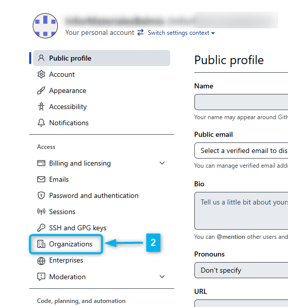

---
title:
    Manual Generar Repositorio
date: 16/06/2021
export_on_save:
    puppeteer: true
    html: true
puppeteer:
    scale: 1
    landscape: false
    format: "A4"
    printBackground: true
    margin:
        top: "1cm"
        right: "1cm"
        bottom: "2.5cm"
        left: "1cm"
    displayHeaderFooter: true
    headerTemplate: "&nbsp;"
    footerTemplate: "
        <span style=\"font-size: 9pt; display: flex;\">
            <span class=\"pageNumber\" style=\"margin-left: 1cm;\"></span>
            /
            <span class=\"totalPages\"></span>
            <span class=\"title\" style=\"margin-left: 1cm;\"></span>
            <span style=\"margin-left: 1cm;\">Departamento de Informática IES Doctor Balmis</span>
        </span>
                    "
toc:
    depth_from: 1
    depth_to: 4
    ordered: false
---

# Manual :construction_worker: ==EN CONSTRUCCIÓN==  :construction:{ignore=true}

[Descargar estos apuntes](./manual_crear_repositorio.pdf)

## Índice {ignore=true}

[TOC]

<div style="page-break-after:always;"></div>

## Pre-Requisitos

1. Tener una **cuenta de GitHub**.
2. Tener instalado **Google Chrome** en el equipo.
3. Tener instalado **[Git](https://git-scm.com/download/win)** en local. **Si es la primera vez que trabajas con git**, deberás configurar tu nombre y correo electrónico. Para ello, puedes usar el siguiente comando en la terminal de Windows o Git Bash:

   ```cmd
   C:\materiales> git config --global user.name "Nombre Apellido"
   C:\materiales> git config --global user.email "cuenta@iesdoctorbalmis.com"
   ```

4. Tener el Java Runtime instalado mínimo la versión 17.
5. Tener instalado **[Visual Studio Code](https://code.visualstudio.com/)**. Puedes descargar la versión portable ya preparada de **[GDrive](https://drive.google.com/drive/u/0/folders/1LaryOjKFO4osOZkenHwuBcZ4U7rH1Gan)** en la carpeta del Departamento.

    Si ya lo tienes instalado puedes crearte un perfil personalizado de "***Apuntes con Markdown***" con las siguientes extensiones:

      * **Spanish Language Pack for VSCode** (para traducir el IDE al español)
      * **Code Spell Checker** (para detectar corrección ortográfica y sintáctica en  textos)
      * ***Spanish - Code Spell Checker*** (paquete de idioma español para el corrector ortográfico)
      * **Open in browser** (para abrir un archivo HTML en el navegador con botón derecho)
      * **Markdown All in One** (para trabajar con archivos markdown)
      * **Markdown Preview Enhanced** (para visualizar el archivo .md)
      * **markdownlint** (para comprobar el contenido del archivo)
      * **PlauntUML** (para mostrar colores en bloques de código de diagramas)
      * Visual Studio Keymap (para usar los atajos de teclado de Visual Studio)

### Esquema de carpetas tras la instalación

<div class="row">
<div class="col-sm-7">

En la capeta **`[data]`** está la configuración local del usuario de VSCode, en la carpeta **`[extensions]`** están las extensiones instaladas y en la carpeta descritas en el punto anterior y en la carpeta **`[user-data]`** está la configuración global del usuario de VSCode como pueden ser los snippets, temas, configuraciones de usuario, etc.

</div>
<div class="col-sm-5">


</div>
</div>

En la carpeta **`[jar]`** está el ejecutable de PlantUML que markdown-preview-enhanced utiliza para renderizar los diagramas, ya está preconfigurado en la instalación portable, pero para funcionar necesitarás tener el JRE de Java instalado como se comentaba anteriormente.

<div style="page-break-after:always;"></div>

## Creación del Workspace

Se ha creado una cuenta de GitHub para el departamento de informática del IES Doctor Balmis, para gestionar los repositorios con materiales para los módulos de Digitalización y Sosténibilidad. La cuenta es **`infor.materiales@iesdoctorbalmis.com`** y la clave de acceso es la usar de forma tradicional en el departamento para administración.

!!! warning Aviso
    Esta cuenta es solo para labores administrativas y no se debe usar para trabajos personales. Por lo que para acceder o clonar los repositorios de trabajo hay que usar la cuenta personar de GitHub y si no se tiene acceso a alguna organización dependiente de esta cuenta. Podemos usar esta cuenta para añadirnos como colaboradores en la mismas.

Partir de la **plantilla** de trabajo que se ha creado para el departamento. Para ello, deberemos seguir los siguientes pasos:

1. En el siguiente **[repositorio público de GitHub](https://github.com/InforMaterialesBalmis/plantillamd)**, debes clonar el repositorio en tu equipo local. Pude que te pida autenticación de acceso a GitHub por lo que te aparecerá una autenticación inicial que te generará una credenciales de acceso desde tu equipo local. Para ello, puedes usar el siguiente comando en la terminal de Windows o Git Bash:

   ```cmd
   C:\materiales> git clone https://github.com/InforMaterialesBalmis/plantillamd.git
   ```

2. Una vez clonado el repositorio, debes entrar en la carpeta **`plantilla`** que habrá creado y borrar la carpeta **`.git`** que se ha creado al clonar el repositorio. Para ello, puedes usar el siguiente comando en la terminal de Windows o Git Bash:

   ```cmd
   C:\materiales> cd plantillamd
   C:\materiales\plantillamd>
   C:\materiales\plantillamd> del /s /q .git
   ```

3. Usando la cuenta **`infor.materiales@iesdoctorbalmis.com`** creamos una nueva organización en GitHub. Para ello, desplegamos el menú de la derecha pulsando sobre el avatar y seleccionamos **`Settings`** :one:, en settings seleccionamos **`Organizations`** :two: y pulsamos sobre el botón **`New organization`** :three:. En nuestros ejemplos, hemos creado la organización **balmisdigigs** :four:, pero **puedes poner un nombre identificativo de tu módulo como y nivel**.

    <div class="row">
    <div class="col-sm-6 d-flex justify-content-center">

    {height=300}

    </div>
    <div class="col-sm-6 d-flex justify-content-center">

    {height=300}

    </div>
    <div class="col-sm-12 d-flex justify-content-center">

    {height=300}

    </div>
    </div>

4. Una vez tenemos la organización creada accedemos a la misma a través de la pantalla anterior y lo primero que revisaremos es los colaboradores (**`People`** :one:) que van a tener acceso a sus repos privados y los permisos que tendrán. 

    { style="display:block;margin:0 auto;width:40%;max-height:300px;" }

5. Deberemos crear una rama personalizada de trabajo, debería llevar tu nombre en minúsculas por ejemplo **`profesorx`**. Para ìr trabajando en ella, y tener el trabajo separado del resto de compañeros si en el futuro se añaden más colaboradores.

   ```cmd
   C:\materiales> git branch profesorx
   C:\materiales> git checkout profesorx
   C:\materiales> git push -u origin profesorx
   ```

<div style="page-break-after:always;"></div>

## Flujo de trabajo y configuraciones

1. Trabajar en una rama con nuestro nombre y asegurarnos que trabajamos en ella.
2. (Opcional) Arrastrar el issue a la columna In Progress del Kanban.
3. Al finalizar la sesión:

   ```cmd
   git add . 
   git commit -m "mensaje"
   git push
   ```

4. Aquí puedo volver al punto 2 y seguir trabajando en el issue.
5. Al finalizar mi trabajo, inicio el proceso de Revisión/Integración.

   1. Ejecutar este Wroflow (está en **`posible_workflow_github.cmd`**).

        ```cmd
        git fetch origin
        git merge origin/main
        git push

        git checkout main
        git merge MI_RAMA
        git push
        git checkout MI_RAMA
        ```


   4. Una vez se ejecute el push en la rama main de GitHub se desencadenan las siguientes acciones en **`.github\workflows\publicar_web_action.yaml`**

        ```yaml
        # Al hacerse Push en master
        on:
        push:
            branches: [ main ]

        # Ejecuta este workflow secuencial (otro job se ejecutaría en paralelo)
        jobs:
        # Solo hay un trabajo llamado sincronizaA
        publica:
            # Se ejecuta en una máquina de ubuntu
            runs-on: ubuntu-latest

            # Secuencia de pasos
            steps:
            # Checks-out your repository under $GITHUB_WORKSPACE, so your job can access it
            - uses: actions/checkout@v4

            # Runs a set of commands using the runners shell
            # DEBO ELIMINAR CON rm AQUELLAS CARPETAS QUE NO QUIERO PUBLICAR !!!
            - name: Crea carpeta a publicar en www
                run: |
                rsync -av --prune-empty-dirs --include-from=rsync_files.txt ./ www/                 
                rm -Rv www/ejemplos
                rm -Rv www/.crossnote

            - name: Despliego www en el repo donde tengo github pages
                uses: peaceiris/actions-gh-pages@v3
                with:
                personal_token: ${{ secrets.DEPLOY_GH_KEY }}
                external_repository: ORGANIZACION/REPOPUBLICO.github.io
                publish_branch: main
                publish_dir: ./www
                allow_empty_commit: true
        ```

        Contenido de **`rsync_files.txt`** para que se publique solo lo necesario.

        ```txt
         + */
         + *.html
         + *.pdf
         + *.png
         + *.jpeg
         + *.jpg
         + *_ejemplo.cs
         + *_caso_de_estudio.zip
         + *.svg
         - *
        ```


