---
title:
    Manual Para Generar Contenido
date: 16/06/2021
export_on_save:
    puppeteer: true
    html: true
puppeteer:
    scale: 1
    landscape: false
    format: "A4"
    printBackground: true
    margin:
        top: "1cm"
        right: "1cm"
        bottom: "2.5cm"
        left: "1cm"
    displayHeaderFooter: true
    headerTemplate: "&nbsp;"
    footerTemplate: "
        <span style=\"font-size: 9pt; display: flex;\">
            <span class=\"pageNumber\" style=\"margin-left: 1cm;\"></span>
            /
            <span class=\"totalPages\"></span>
            <span class=\"title\" style=\"margin-left: 1cm;\"></span>
            <span style=\"margin-left: 1cm;\">Departamento de Informática IES Doctor Balmis</span>
        </span>
                    "
toc:
    depth_from: 1
    depth_to: 4
    ordered: false
---

# Manual para generar contenido con el marco de trabajo basado en MDE{ignore=true}

[Descargar estos apuntes](./manual_generar_contenido.pdf)

## Índice {ignore=true}

[TOC]

<div style="page-break-after:always;"></div>

## Pre-Requisitos

1. Tener una **cuenta de GitHub**.
2. Tener instalado **Google Chrome** en el equipo.
3. Tener instalado **[Git](https://git-scm.com/download/win)** en local. **Si es la primera vez que trabajas con git**, deberás configurar tu nombre y correo electrónico. Para ello, puedes usar el siguiente comando en la terminal de Windows o Git Bash:

   ```cmd
   C:\materiales> git config --global user.name "Nombre Apellido"
   C:\materiales> git config --global user.email "cuenta@iesdoctorbalmis.com"
   ```

4. Tener el Java Runtime instalado mínimo la versión 17.
5. Tener instalado **[Visual Studio Code](https://code.visualstudio.com/)**- Puedes descargar la versión portable ya preparada de **[GDrive](https://drive.google.com/drive/u/0/folders/1LaryOjKFO4osOZkenHwuBcZ4U7rH1Gan)** en la carpeta del Departamento.

    Si ya lo tienes instalado puedes crearte un perfil personalizado de "***Apuntes con Markdown***" con las siguientes extensiones:

      * **Spanish Language Pack for VSCode** (para traducir el IDE al español)
      * **Code Spell Checker** (para detectar corrección ortográfica y sintáctica en  textos)
      * ***Spanish - Code Spell Checker*** (paquete de idioma español para el corrector ortográfico)
      * **Open in browser** (para abrir un archivo HTML en el navegador con botón derecho)
      * **Markdown All in One** (para trabajar con archivos markdown)
      * **Markdown Preview Enhanced** (para visualizar el archivo .md)
      * **markdownlint** (para comprobar el contenido del archivo)
      * **PlauntUML** (para mostrar colores en bloques de código de diagramas)
      * Visual Studio Keymap (para usar los atajos de teclado de Visual Studio)

### Esquema de carpetas tras la instalación

<div class="row">
<div class="col-sm-7">

En la capeta **`[data]`** está la configuración local del usuario de VSCode, en la carpeta **`[extensions]`** están las extensiones instaladas y en la carpeta descritas en el punto anterior y en la carpeta **`[user-data]`** está la configuración global del usuario de VSCode como pueden ser los snippets, temas, configuraciones de usuario, etc.

</div>
<div class="col-sm-5">

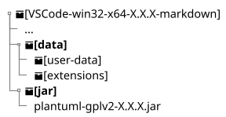

</div>
</div>

En la carpeta **`[jar]`** está el ejecutable de PlantUML que markdown-preview-enhanced utiliza para renderizar los diagramas, ya está preconfigurado en la instalación portable, pero para funcionar necesitarás tener el JRE de Java instalado como se comentaba anteriormente.

<div style="page-break-after:always;"></div>

## Acceso al Workspace

Este manual esta pensado para trabajar con las herramientas anteriores y con un workspace de trabajo ya creado. Si lo que deseas es crear un nuevo workspace, puedes hacerlo seguir los pasos de la siguiente la guía **`manual_crear_repositorio.pdf`** que se encuentra junto a este manual.

Supongamos que estamos en una **organización de GitHub** y tenemos un espacio de trabajo ya creado en una organización siguiendo los pasos de la guía anterior. Veamos un ejemplo de cómo **clonarla en local** con el siguiente supuesto...

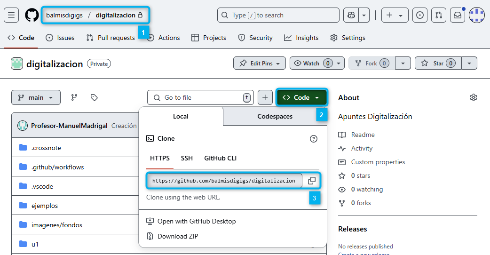{ style="display:block;margin:0 auto;max-width:600px;" }

Como se muestra en la imagen, nos encontramos en el repositorio privado de materiales en nuestra organización :one:. Pulsaremos el botón **`Code`** :two: y copiaremos la URL del repositorio :three:. Por último, abriremos la terminal de Windows y ejecutaremos el siguiente comando para clonar el repositorio en local:

```cmd
C:\materiales> git clone https://github.com/balmisdigigs/digitalizacion.git
C:\materiales> cd digitalizacion
C:\materiales\digitalizacion> code .
```

### Descripción del contenido del repositorio

No es la idea de este manual profundizar en el uso de **[VSCode](https://code.visualstudio.com/docs/editing/codebasics)**, pero sí trabajar las opciones principales que nos ofrece para trabajar con Markdown.

Al cargar nuestro workspace de digitalización y abrir un fichero **`.md`** (markdown) nos encontraremos con la siguiente pantalla:

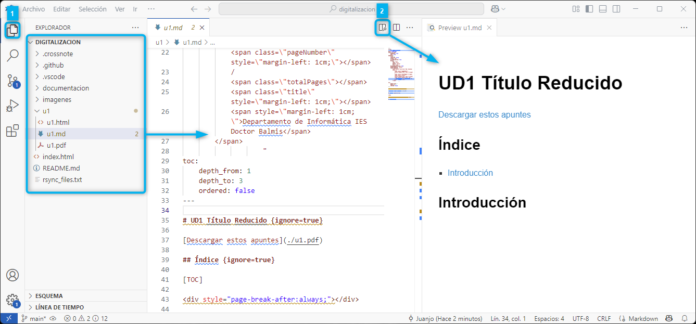{ style="display:block;margin:0 auto;max-width:750px;" }

En ella, para ver el árbol de carpetas y archivos, pulsaremos el icono de la parte superior izquierda **`Explorador`** :one:. Si tenemos la extensión **`Markdown Preview Enhanced`**, en la parte superior derecha, tendremos el icono de **`Vista previa`** (`Markdown Preview Enhanced: Open Preview to the Side`, **`Ctrl + K, V`**) :two:.

En el **vista de previa**, nos renderizará a HTML todo el código que vayamos escribiendo y al situarnos sobre la misma, nos aparecerán nuevos iconos con opciones sobre el mismo. A destacar, el icono arriba a la derecha para refrescar el contenido del preview :three: y el icono para de menú :four: con diferentes opciones. En la imagen de ejemplo hemos seleccionado **`Export  HTML -> HTML (cdn hosted)`** :five: & :six:.

<div class="row">
<div class="col-sm-6 my-auto">

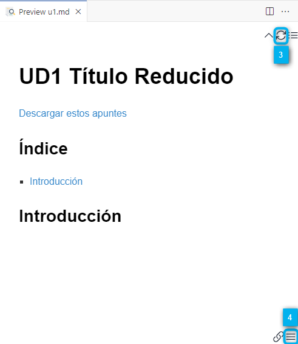{ style="display:block;margin:0 auto;max-width:300px;" }

</div>
<div class="col-sm-6 my-auto">

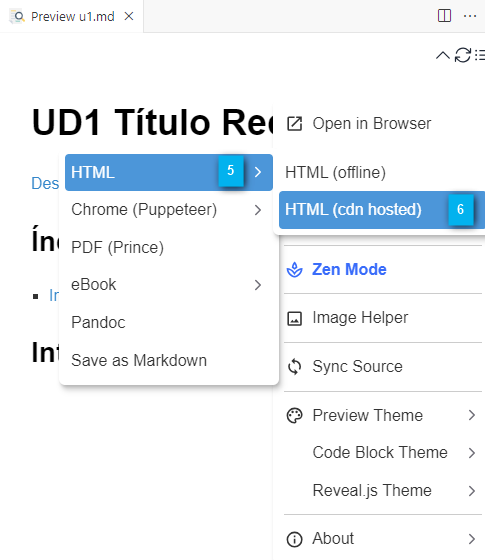{ style="display:block;margin:0 auto;max-width:300px;" }

</div>
</div>

<div style="page-break-after:always;"></div>

## Trabajo básico con markdown

Dispones de la siguiente página con la documentación del Plugin en la **[página de Markdown Preview Enhanced](https://shd101wyy.github.io/markdown-preview-enhanced)**

Dispones de una guía básica de **[Markdown Básico](https://shd101wyy.github.io/markdown-preview-enhanced/#/markdown-basics)** en la misma página.

!!! Note Nota
    La extensión **markdownlint** te ayuda ha escribir markdown normalizado, pero como estamos usando una extensión, no es es muy importante salvo respetar los saltos de línea.
    En la carpeta **`.vscode/`** se han pre-definido varios code snippets (fragmentos de código) para el workspace situados en en fichero **`FragmentosPernosalizados.code-snippets`** dentro de la carpera .**`.vscode/`**. Estos fragmentos de código son plantillas que se insertan en el editor. Para usarlas, una vez abierto un fichero con extensión markdown escribiremos **`mde_`** seguido de **`Ctrl + Space`** que es el (trigger suggestions) en mi KeyMap.

### Markdown básico

#### Encabezados

```markdown
# Título 1
## Título 2
### Título 3
...
```

#### Párrafos

Estándar en Markdown, solo hay que dejar una línea en blanco entre párrafos.

```markdown
Párrafo con una palabra en **negrita**
Párrafo con una palabra en *cursiva*
Párrafo con una palabra en ***negrita y cursiva***
Párrafo con una palabra en ~~tachado~~
Párrafo con una palabra en `código`
Párrafo con una palabra en **`código en negrita`**
Párrafo con una palabra en *`código en cursiva`*
Párrafo con una palabra en ***`código en negrita y cursiva`***

Los metacaracteres de Markdown son: `*`, `_`, `~`, `\` y `#` y 
deberás escaparlos con `\` si quieres que aparezcan en el texto.
```

!!! Note Nota
    Al tener el plugin "**Markdown All in One**" instalado, si selecciones una palabra y escribes un **\*** o **\`** se le añade el formato correspondiente a ambos lados de la selección y no sustituye el texto seleccionado.

#### Citas

En el estándar de Markdown, cada párrafo precedido del caracter **`>`** formará parte de la cita.

<div class="row">
<div class="col-sm-6 my-auto">

```txt
> Un país, una civilización se puede juzgar  
> por la forma en que trata a sus animales.  
> — Mahatma Gandhi
```

</div>
<div class="col-sm-6 my-auto">

> Un país, una civilización se puede juzgar  
> por la forma en que trata a sus animales.  
> — Mahatma Gandhi

</div>
</div>

##### Citas fuera del stándar

También podremos definir una cita con las **[admonitions de Mkdocs](https://squidfunk.github.io/mkdocs-material/reference/admonitions/)**. Las tienes definidas como fragmentos de código con la raíz **`mde_cuadro_`** por tanto si pulsas **`mde_cuadro_`** seguido de **`Ctrl + Space`** te ofrecerá **`mde_cuadro_cita`** que te insertará el fragmento para citas.

<div class="row">
<div class="col-sm-6 my-auto">

```markdown
!!! Quote Cita
    Un país, una civilización se puede juzgar 
    por la forma en que trata a sus animales.  
    — Mahatma Gandhi
```

</div>
<div class="col-sm-6 my-auto">

!!! Quote Cita
    Un país, una civilización se puede juzgar
    por la forma en que trata a sus animales.  
    — Mahatma Gandhi

</div>
</div>

<div style="page-break-after:always;"></div>

Un poco más vistosas, las tienes definidas como fragmentos de código con **`mde_cita_HTML`** que generará lo siguiente:

```html
<div class="contenedor">
    <div class="fondo">
        <div class="abre_comilla">"</div>
        <div class="cierra_comilla">"</div>
        <div class="cita">Un país, una civilización se puede 
        juzgar por la forma en que trata a sus animales.</div>
        <div class="autor">- Mahatma Gandhi</div>
    </div>
</div>
```

<div class="contenedor">
    <div class="fondo">
        <div class="abre_comilla">"</div>
        <div class="cierra_comilla">"</div>
        <div class="cita">Un país, una civilización se puede juzgar 
        por la forma en que trata a sus animales.</div>
        <div class="autor">- Mahatma Gandhi</div>
    </div>
</div>

<div style="page-break-after:always;"></div>

### Listas

```markdown
* Elemento 1
* Elemento 2
  * Elemento 2.1 (alineado primera letra item padre)
    * Elemento 2.1.1
* Elemento 3
```

```markdown
1. Elemento 1
2. Elemento 2
   1. Elemento 2.1 (alineado primera letra item padre)
      1. Elemento 2.1.1antes)
3. Elemento 3
```

Respetar los espacios es muy importante para que cierto contenido pertenezca o no a un elemento de la lista.

<div class="row">
<div class="col-sm-6 my-auto">

```markdown
* Elemento 1
  Este párrafo pertenece al elemento 1
  * Conviene separar las listas indentadas
    Este párrafo pertenece al elemento 1.1
    Este párrafo pertenece al elemento 1.1

  Separa con un **salto de línea** para cotinuar
  en el nivel anterior
* Elemento 2
  Este párrafo pertenece al elemento 2
  Este párrafo pertenece al elemento 2

Este párrafo ya está fuera de la lista
```

</div>
<div class="col-sm-6 my-auto">

* Elemento 1
  Este párrafo pertenece al elemento 1
  * Conviene separar las listas indentadas
    Este párrafo pertenece al elemento 1.1
    Este párrafo pertenece al elemento 1.1

  Separa con un **salto de línea** para cotinuar
  en el nivel anterior
* Elemento 2
  Este párrafo pertenece al elemento 2
  Este párrafo pertenece al elemento 2

Este párrafo ya está fuera de la lista

</div>
</div>

### Tablas simples

<div class="row">
<div class="col-sm-6 my-auto">

```markdown
| Columna 1  | Columna 2  | Columna 3  |
| ---------- | ---------- | ---------- |
| Elemento 1 | Elemento 2 | Elemento 3 |
| Elemento 4 | Elemento 5 | Elemento 6 |
```

</div>
<div class="col-sm-6 my-auto">

| Columna 1  | Columna 2  | Columna 3  |
| ---------- | ---------- | ---------- |
| Elemento 1 | Elemento 2 | Elemento 3 |
| Elemento 4 | Elemento 5 | Elemento 6 |

</div>
</div>

> :bulb: **Tip:** Con **`Ctrl + K + D`** puedes hacer que la tabla se alienee correctamente.

<div style="page-break-after:always;"></div>

### Enlaces

1. Enlace normal por ejemplo a [Goole](http://www.google.com):

    ```markdown
    [Goole](http://www.google.com)
    ```

2. Enlace **negrita** por ejemplo a **[Goole](http://www.google.com)**:

    ```markdown
    **[Goole](http://www.google.com)**
    ```

3. Referencia directa <http://www.google.com>

    ```markdown
    <http://www.google.com>
    ```

### Imágenes

!!! Tip Tip
    Si usas VSCode y arrastras el archivo de imagen a la ventana del editor y justo antes de soltarla (drop) pulsas la tecla **`Shift`** te insertará la imagen en el formato correcto para Markdown.

#### Estándar imágenes básico

```markdown


{ width=200 }
{ height=100 }
```

Por ejemplo:

```markdown
{ width=300}
```

{ width=300}

#### Ampliación imágenes

Un poco más vistosas, las tienes definidas como fragmentos de código con **`mde_imagenCentrada`** que generará lo siguiente, donde controlamos el tamaño de la imagen y al tener el margen automático, se centra la imagen en la página.

```markdown
{ style="display:block; margin:0 auto; width:75%;max-width:300px;" }
```

{ style="display:block; margin:0 auto; width:75%;max-width:300px;" }

<div style="page-break-after:always;"></div>

## Expresiones matemáticas

Fuera del estándar de Markdown, para escribir expresiones matemáticas, **Markdown Preview Enhanced** utiliza **[KaTeX](https://katex.org/)** que representa las expresiones como si fuera Latex, en este enlace tienes una **[chuleta de uso](https://www.cmor-faculty.rice.edu/~heinken/latex/symbols.pdf)**.

Añadiendo **un solo símbolo del dolar** antes y después del código Latex **`$f(x) = x^2+3$`** que generaría como está función $f(x) = x^2+3$ con display en línea.

Añadiendo **dos símbolos del dólar** antes y después del código Latex **`$$f(x) = x^2+3$$`** la misma función con display block, esto és en un párrafo a parte y centrada.
$$f(x) = x^2+3$$

<div class="box_bg_lightgray">

**Ejemplo en línea:**

```markdown
The homomorphism $f$ is injective if and only if its kernel is only the singleton set $e_G$, 
because otherwise $\exists a,b\in G$ with $a\neq b$ such that $f(a)=f(b)$.
```

The homomorphism $f$ is injective if and only if its kernel is only the singleton set $e_G$, 
because otherwise $\exists a,b\in G$ with $a\neq b$ such that $f(a)=f(b)$.

</div> <!-- fin ejemplo -->

<div class="box_bg_lightgray">

**Ejemplo en bloque:**

<div class="row">
<div class="col-sm-6 my-auto">

```markdown
$$
\cos x=
\sum_{k=0}^{\infty}
\frac{(-1)^k}{(2k)!}x^{2k}
$$
```

</div>
<div class="col-sm-6 my-auto">

$$
\cos x=
\sum_{k=0}^{\infty}
\frac{(-1)^k}{(2k)!}x^{2k}
$$
</div>
</div>

</div> <!-- fin ejemplo -->

<div class="box_bg_lightgray">

**Otros ejemplos:**

<div class="row">
<div class="col-sm-6 my-auto">

```markdown
$$
\lim_{x\to\infty} \frac{1}{x} = 0
$$
```

</div>
<div class="col-sm-6 my-auto">

$$
\lim_{x\to\infty} \frac{1}{x} = 0
$$

</div>
<div class="col-sm-6 my-auto">

```markdown
$$
x = \begin{cases}
   a    &\text{if } b \\
   c    &\text{if } d
\end{cases}
$$
```

</div>
<div class="col-sm-6 my-auto">

$$
x = \begin{cases}
   a    &\text{if } b \\
   c    &\text{if } d
\end{cases}
$$

</div>
<div class="col-sm-6 my-auto">

```markdown
$$
\begin{pmatrix}
   a & b \\
   c & d
\end{pmatrix}
\begin{bmatrix}
   a & b \\
   c & d
\end{bmatrix}
$$
```

</div>
<div class="col-sm-6 my-auto">

$$
\begin{pmatrix}
   a & b \\
   c & d
\end{pmatrix}
\begin{bmatrix}
   a & b \\
   c & d
\end{bmatrix}
$$

</div>
<div class="col-sm-6 my-auto">

```markdown
$$
\begin{pmatrix} 
    1 & 2 \\ 
    3 & 4 
\end{pmatrix} 
\quad \text{es distinto a} \quad 
\begin{pmatrix} 
    5 & 6 \\ 
    7 & 8 
\end{pmatrix}
$$
```

</div>
<div class="col-sm-6 my-auto">

$$
\begin{pmatrix} 
    1 & 2 \\ 
    3 & 4 
\end{pmatrix} 
\quad \text{es distinto a} \quad 
\begin{pmatrix} 
    5 & 6 \\ 
    7 & 8 
\end{pmatrix}
$$

</div>
<div class="col-sm-6 my-auto">

```markdown
$$
\alpha, \beta, \gamma, \Delta
$$
```

</div>
<div class="col-sm-6 my-auto">

$$
\alpha, \beta, \gamma, \Delta
$$

</div>
<div class="col-sm-6 my-auto">

```markdown
$$
\int_{a}^{b} f(x) \, dx
$$
```

</div>
<div class="col-sm-6 my-auto">

$$
\int_{a}^{b} f(x) \, dx
$$

</div>
</div>

</div> <!-- fin ejemplo -->

<div style="page-break-after:always;"></div>

## Bloques de código

!!! Info Enalaces
    **[Code Chunks - Markdown Preview Enhanced](https://shd101wyy.github.io/markdown-preview-enhanced/#/code-chunk)**

Además de la **`** para escribir código en línea, podemos usar **```** para escribir bloques de código. En el caso de que queramos resaltar el lenguaje a usar, **lo indicaremos justo después de la primera línea de apertura del bloque de código**. **Markdown Preview Enhanced** usa la librería **Prism.js** para resaltar el código. Puedes ver la lista de lenguajes soportados en la **[página de Prism.js](https://prismjs.com/#supported-languages)**.

> :pushpin: **Nota**: Puedes usar el code snippet **`mde_bloque_C#`** para recordar como añadir líneas y resaltarlas.


<div class="row">
<div class="col-sm-7 my-auto">

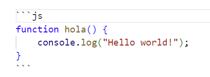{width=250}

</div>
<div class="col-sm-5 my-auto">

```js
function hola() {
    console.log("Hello world!");
}
```

</div>
<div class="col-sm-7 my-auto">

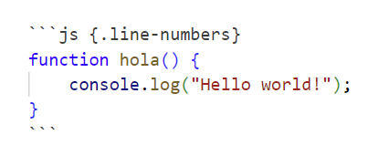{width=250}

</div>
<div class="col-sm-5 my-auto">

```js {.line-numbers}
function hola() {
    console.log("Hello world!");
}
```

</div>
<div class="col-sm-7 my-auto">

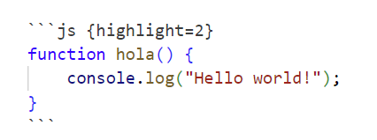{width=250}

</div>
<div class="col-sm-5 my-auto">

```js {highlight=2}
function hola() {
    console.log("Hello world!");
}
```

</div>
</div>

<div style="page-break-after:always;"></div>

## Admonitions

!!! Info Enalaces
    **[Admonitions de MKdocs](https://squidfunk.github.io/mkdocs-material/reference/admonitions/)**

Deberemos usar **`!!! <tipo> <título>`** y posteriormente el código englobado en el cuadro en una línea inferior indentado/tabulado a la derecha.

```markdown
!!! note Nota
    Este es un bloque de nota.
    Con dos líneas de texto.
```

Dispondremos de **varios tipos** que puedes visualizar en la siguiente tabla:

<div class="row">
<div class="col-sm-4 my-auto">

!!! note note

</div>
<div class="col-sm-4 my-auto">

!!! info info

</div>
<div class="col-sm-4 my-auto">

!!! abstract abstract

</div>
<div class="col-sm-4 my-auto">

!!! example example

</div>
<div class="col-sm-4 my-auto">

!!! quote quote

</div>
<div class="col-sm-4 my-auto">

!!! tip tip

</div>
<div class="col-sm-4 my-auto">

!!! success success

</div>
<div class="col-sm-4 my-auto">

!!! question question

</div>
<div class="col-sm-4 my-auto">

!!! warning warning

</div>
<div class="col-sm-4 my-auto">

!!! failure failure o error

</div>
<div class="col-sm-4 my-auto">

!!! danger danger

</div>
<div class="col-sm-4 my-auto">

!!! bug bug

</div>
</div>

<div style="page-break-after:always;"></div>

## Emojis de GitHub Markdown

Con el plugin de **Markdown Preview Enhanced** podemos usar los emojis de GitHub. Para ello, simplemente escribiremos el nombre del emoji entre dos puntos **`:`**. Por ejemplo: **`:smile:`** representará :smile:

<div class="box_bg_lightgray">

**Ejemplos de iconos que pueden ser útiles:**

| Números                     | Señales                                     | Objetos                   | Otros                           |
| --------------------------- | ------------------------------------------- | ------------------------- | ------------------------------- |
| :one: `:one:`               | :heavy_check_mark: `:heavy_check_mark:`     | :computer: `:computer:`   | :fire: `:fire:`                 |
| :two: `:two:`               | :heavy_plus_sign: `:heavy_plus_sign:`       | :book: `:book:`           | :star: `:star:`                 |
| :three: `:three:`           | :warning: `:warning:`                       | :pencil2: `:pencil2:`     | :+1: `:+1:`                     |
| :four: `:four:`             | :x: `:x:`                                   | :bulb: `:bulb:`           | :-1: `:-1:`                     |
| :five: `:five:`             | :construction: `:construction:`             | :mag: `:mag:`             | :hand: `:hand:`                 |
| :six: `:six:`               | :white_check_mark: `:white_check_mark:`     | :pushpin: `:pushpin:`     | :mega: `:mega:`                 |
| :seven: `:seven:`           | :arrow_right: `:arrow_right:`               | :package: `:package:`     | :link: `:link:`                 |
| :eight: `:eight:`           | :arrow_forward: `:arrow_forward:`           | :computer: `:computer:`   | :rocket: `:rocket:`             |
| :nine: `:nine:`             | :information_source: `:information_source:` | :clipboard: `:clipboard:` | :pill: `:pill:`                 |
| :keycap_ten: `:keycap_ten:` | :skull: `:skull:`                           | :key: `:key:`             | :mortar_board: `:mortar_board:` |

> :pushpin: **Nota**: Puedes ver la lista completa de emojis en la **[GitHub Emoji Cheat Sheet](https://gist.github.com/rxaviers/7360908)**.

</div> <!-- fin ejemplo -->


<div style="page-break-after:always;"></div>

## Diagramas

!!! Info Enalaces
    * **[Diagrams - Markdown Preview Enhanced](https://shd101wyy.github.io/markdown-preview-enhanced/#/diagrams)**
    * **[Graphviz](https://graphviz.org/)**

**Markdown Preview Enhanced** soporta varios tipos de diagramas, entre ellos: **PlantUML**, **Mermaid**, **Graphviz** etc. Vamos a ver algunos de los más comunes.

La sintaxis es similar a la de los bloques de código, pero en vez de usar el nombre del lenguaje, usaremos el nombre del tipo de diagrama. Por ejemplo vemos un diagrama de tipo **dot** de **Graphviz**:

<div class="row">
<div class="col-sm-4">

El tamaño (**`"ancho,alto"`**) lo establecemos en pulgadas con la propiedad **`size`** Por defecto el diagrama quedará alineado a la derecha dentro de su contenedor.

</div>
<div class="col-sm-4 my-auto">

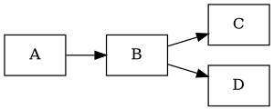

</div>
<div class="col-sm-4 my-auto">

{height=120}

</div>
<div class="col-sm-4 my-auto">

No especificamos tamaño al interprete de Graphviz y lo hacemos al parser de Markdown Preview Enhanced. Donde le decimos que esté cxentrado y le aplicamos un zoom del 0.7 (70%) con la propiedad **`style`**.
:-1: **Aplicar zoom a traves del estilo no es buena práctica.**

</div>
<div class="col-sm-4 my-auto">

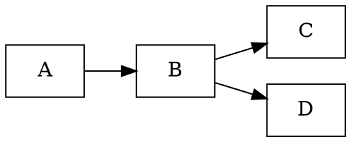

</div>
<div class="col-sm-4 my-auto">

{height=120}

</div>
<div class="col-sm-4 my-auto">

:+1: Es la mejor opción, ya que establecemos un **viewport en píxeles** y el **zoom de 0.7 (70%)** para que el diagrama quepa en el viewport. Además, de forma opcional le podemos indicar que **centre el viewport en el nodo `B`**.

</div>
<div class="col-sm-4 my-auto">

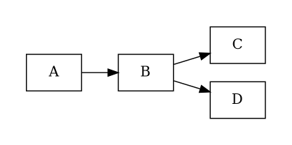

</div>
<div class="col-sm-4 my-auto">

{height=120}

</div>
</div>

<div style="page-break-after:always;"></div>


<div class="box_bg_lightgray">

**Ejemplo diagrama graphviz representando JRE:**

{ style="display:block;margin:0 auto;width:100%;max-height:650px;" }

@import "assets/imagenes/generar_contenido/JRE.dot" {align="center"}

</div> <!-- fin ejemplo -->

<div style="page-break-after:always;"></div>

### Renderizado a través de Kroki

**Markdown Preview Enhanced** soporta además renderizado a través de **[servidor de Kroki](https://kroki.io/)**, que es un servicio de diagramas online. Para ello, deberás configurar el servidor **<https://kroki.io/>** en la extensión de **Markdown Preview Enhanced** (ya está configurado por defecto). Puesto que es un servicio online, no es necesario instalar nada en local. Pero solo funcionará si tienes acceso a Internet y el servidor está activo o admite el tipo de diagrama que deseas generar. Para renderizar con Kroki, simplemente debes escribir el nombre del diagrama seguido de **`{kroki=true}`**. 

Por ejemplo: **` ```dot {kroki=true} `**

### Incluir diagramas desde un fichero externo

!!! Info Enalces
    **[File Imports - Markdown Preview Enhanced](https://shd101wyy.github.io/markdown-preview-enhanced/#/file-imports)**


La sintaxis para incluir un fichero externo es **`@import "<fichero>"{<modificadores_opciona>}`**

Realmente pudes importar muchos tipos de ficheros..

* **Imágenes**: png, jpg, svg, bmp, gif, ...
* **Datos a ver como tabla**: csv
* **Diagramas**: dot, puml, mermaid.
* **Código**: js, py, json, html, css, less, md

Un uso común es importar diagramas. Por ejemplo, el diagrama dot del ejemplo anterior lo tenemos guardado en un fichero **`JRE.dot`**. Para importarlo, simplemente escribimos:

```markdown
@import "assets/imagenes/generar_contenido/JRE.dot" {align="center"}
```

y el plugin se encargará de renderizarlo en local y si ponemos **`{align="center", kroki=true}`** a través del servidor de Kroki.

<div style="page-break-after:always;"></div>

### Ejemplos con PlantUML

!!! Info Enalaces
    **[Página oficial de PlantUML](https://plantuml.com/)**

En ella puedes todos los tipos de diagramas que se pueden generar y suelen estar soportados por **Markdown Preview Enhanced** y otros parsers de markdown. Si renderizamos en local, deberemos tener el JRE instalado y el parser **`plantuml.jar`** referenciado en la configuración de la extensión (si estás utilizando nuestro entrono esto ya está hecho), en caso contrario, podemos usar **Kroki**.

Se han añadido algunos fragmentos de código para facilitar la creación de diagramas.

<div class="box_bg_lightgray">

#### Ejemplo contenido carpetas (wireframe puml)

Es un diagrama de tipo **wireframe** que representa un espacio de trabajo con carpetas y archivos.

Usaremos el fragmento **`mde_puml`** + **`Ctrl + Space`** y seleccionaremos **`mde_puml_folder_tree`** + **`Tab`** insertándonos el siguiente código. Fíjate que el tamaño, lo hemos controlado con la propiedad **`Scale`** y si queremos que el color de fondo sea transparente, lo indicamos con **`skinparam backgroundColor Transparent`**.

<div class="row">
<div class="col-sm-6 my-auto">

{height=300}

</div>
<div class="col-sm-6 my-auto">

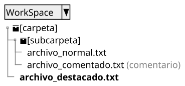

</div>
</div>

</div> <!-- fin ejemplo -->

<div style="page-break-after:always;"></div>

<div class="box_bg_lightgray">

#### Ejemplo arquitectura (C4 puml)

El **[modelo C4](https://c4model.com/)** es un estándar para la representación de arquitecturas de software. La idea es representar la arquitectura de un sistema en diferentes niveles de detalle (hasta 4).

Para usarlo con **PlantUML** usaremos la librería **[C4-PlantUML](https://github.com/plantuml-stdlib/C4-PlantUML)** que es un conjunto de plantillas para representar el modelo C4. Para obtener los iconos de los diferentes tipos de sistemas, puedes usar la librería **[devicons2](https://github.com/tupadr3/plantuml-icon-font-sprites/blob/main/icons/devicons2/index.md)** que ya los define el formato que entiende **PlantUML**. En este caso, usaremos el icono de **`android`** para la aplicación, **`tomcat`** para el servidor y **`mysql`** para la base de datos.

Usaremos el fragmento **`mde_puml`** + **`Ctrl + Space`** y seleccionaremos **`mde_puml_c4`** + **`Tab`** insertándonos el siguiente código.

{height=350}

```puml {align="center", korki=true}
@startuml 
!include  https://raw.githubusercontent.com/plantuml-stdlib/C4-PlantUML/master/C4_Container.puml
!include <tupadr3/devicons2/tomcat_line_wordmark>
!include <tupadr3/devicons2/mysql_wordmark>
!include <tupadr3/devicons2/android_wordmark>

skinparam backgroundColor Transparent
Scale 1
 
HIDE_STEREOTYPE()
LAYOUT_LEFT_RIGHT()
 
System(android, "Aplicación", "Retrofit 2", $sprite="android_wordmark")
Container_Boundary(azure, "Azure") {
    System(api, "Endpoint\nAPI Rest","Jakarta EE", $sprite="tomcat_line_wordmark")
    SystemDb(db, "BD", "MySQL", $sprite="mysql")
}
Rel(android, api, "API Rest", "HTTP")
Rel(api, db, "Eclipselink", "JDBC")
@enduml
```

</div> <!-- fin ejemplo -->

<div style="page-break-after:always;"></div>

<div class="box_bg_lightgray">

#### Ejemplo mapa mental

En este ejemplo vamos a incluir un mapa mental. Además, hemos definido un estilo personalizado por niveles de profundidad. Para así ver como añadir estilos a Los diagramas para que todos queden homogéneos.

Usaremos el fragmento **`mde_puml`** + **`Ctrl + Space`** y seleccionaremos **`mde_puml_mindmap`** + **`Tab`** insertándonos el siguiente código.

Puesto que el código es un poco largo, lo hemos sacado a un fichero externo **`mindmap.puml`** y lo importamos con **`@import`**. Puedes ver el código completo en el fichero **`mindmap.puml`** que está en la carpeta **`assets/imagenes/generar_contenido/`**.

```markdown
@import "assets/imagenes/generar_contenido/mindmap.puml" {align="center"}
```

@import "assets/imagenes/generar_contenido/puml_mindmap.puml" {align="center"}

</div> <!-- fin ejemplo -->

<div style="page-break-after:always;"></div>

<div class="box_bg_lightgray">

#### Ejemplo diagrama de flujo

<div class="row">
<div class="col-sm-5 my-auto">

{height=600}

</div>
<div class="col-sm-7 my-auto">

@import "assets/imagenes/generar_contenido/puml_flow.puml"

</div>
</div>

</div> <!-- fin ejemplo -->

<div style="page-break-after:always;"></div>

### Ejemplos con Mermaid

!!! Info Enalaces
    **[Página oficial de Mermaid](https://mermaid.js.org/)**

No necesitas ningún tipo de instalación extra, ya que **Markdown Preview Enhanced** ya lo incluye. Puedes ver la lista de diagramas soportados en la **[página de Mermaid](https://mermaid.js.org/ecosystem/tutorials.html)**.

> :warning: **Aviso**: Este tipo de diagramas están más pensado para rederizar diagramas con frameworks  de generación de documentación basados en JavaScript. Como por ejemplo: Docusaurus, VuePress o Astro Starlight, etc.

<div class="box_bg_lightgray">

#### Ejemplo arquitectura (mermaid)

Para este tipo de diagramas, usaremos el fragmento **`mde_mermaid`** + **`Ctrl + Space`** y seleccionaremos **`mde_mermaid_architecture`** + **`Tab`** insertándonos el siguiente código.

<div class="row">
<div class="col-sm-7 my-auto">

{height=250}

</div>
<div class="col-sm-5 my-auto">

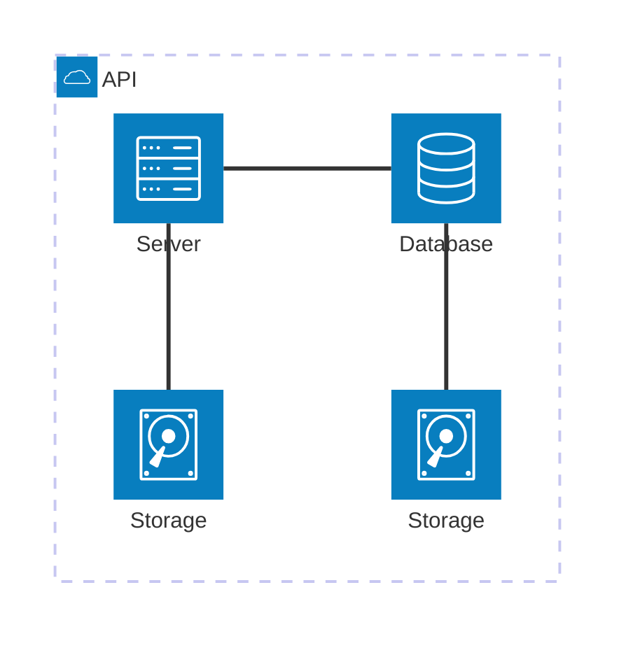

</div>
</div>
</div> <!-- fin ejemplo -->

<div style="page-break-after:always;"></div>

## Maquetación compleja basada en Bootstrap 5

En el marco de trabajo se ha incluido un enlace a **Bootstrap 5** para poder usar su sistema de maquetación y sus componentes. El enlace se ha incluido en el fichero **`.crossnote/style.less`**. Esto nos va a permitir maquetar de forma responsiva sin mucha complejidad.

!!! Warning Aviso
    Markdown no tiene contemplada la maquetación compleja. Por lo que estaremos obligados a usar estiquetas HTML para ello. Además y más importante, requeriremos de conexión a Internet para que funcione correctamente pues el CSS de Bootstrap 5 es CDN Hosted. Por tanto, **si no tienes conexión a Internet, la maquetación no se verá correctamente**.

### Maquetación a 2 o 3 columnas

Cualquer fragmento de código (Snippet) que empiece por la raíz **`mde_bs5`** + **`Ctrl + Space`** incluirá Bootstrap 5. Por ejemplo, el siguente Snippet **`mde_bs5_dosColumnas`** + **`Tab`** generará el siguiente código:

```html
<div class="row">
<div class="col-sm-6 my-auto">

<!-- Escribe aquí tu markdown respetando una línea de separacion -->

</div>
<div class="col-sm-6 my-auto">

<!-- Escribe aquí tu markdown respetando una línea de separacion -->

</div>
</div>
```

En los comentarios puedes incluir cualquier markdown de los vistos anteriormente **respetando el saltao de línea antes y después de comentario**. Por ejemplo, vamos a insertar 2 imágenes....

```html
<div class="row">
<div class="col-sm-6 my-auto">


</div>
<div class="col-sm-6 my-auto">


</div>
</div>
```

<div class="row">
<div class="col-sm-6 my-auto">


</div>
<div class="col-sm-6 my-auto">


</div>
</div>

Podremos cambiar añadir y cabiar el ancho de las columnas siempre y cuando la suma de los anchos sea 12. Por ejemplo ...

```html
<div class="row">
<div class="col-sm-6">

Aquí incluimos un texto en la primera columna de 6 y dos imágenes en la segunda y tercera de 3 y 3 de ancho respectivamente.
Además hemos quitado el **`my-auto`** para que ajuste los párrafos a la parte superior de la columna.

</div>
<div class="col-sm-3 my-auto">


</div>
<div class="col-sm-3 my-auto">


</div>
</div>
```

<div class="row">
<div class="col-sm-6">

Aquí incluimos un texto en la primera columna de 6 y dos imágenes en la segunda y tercera de 3 y 3 de ancho respectivamente.
Además hemos quitado el **`my-auto`** para que ajuste los párrafos a la parte superior de la columna.

</div>
<div class="col-sm-3 my-auto">


</div>
<div class="col-sm-3 my-auto">


</div>
</div>

No vamos a entrar en más detalles de Bootstrap 5, ya que puedes ver la documentación en su **[página oficial](https://getbootstrap.com/docs/5.0/getting-started/introduction/)**. Además, no uns buena idea usarlo ya que está fuera del estándar de Markdown.

<div style="page-break-after:always;"></div>

## Generar PDF

Para generar el PDF, usaremos la librería **[Puppeteer](https://pptr.dev/)** que es una librería de Node.js que proporciona una API de alto nivel para controlar Chrome o Chromium a través del protocolo DevTools. Permite generar PDFs a partir de páginas web, entre otras cosas. **Solo deberemos tener instalado Google Chrome o Chromium en el sistema para poder usarla**.

Con el plugin de *Markdown Preview Enhanced*, si estamos viendo la vista, modificamos el markdown y lo guardamos, se generará un PDF automáticamente. Para ello, en el frontmatter en YAML, deberemos tener configurada la propiedad **`export_on_save`** y configurado el atributo **`puppeteer`** a `true`. Además, a través de la propiedad **`puppeteer`**, podemos **[configurar](https://github.com/puppeteer/puppeteer/blob/v1.9.0/docs/api.md#pagepdfoptions)** el tamaño del PDF, márgenes, orientación, etc. Como se muestra en la configuración del frontmatter del siguiente ejemplo:

```yaml
---
...
export_on_save:
    puppeteer: true
    html: true
puppeteer:
    scale: 1
    landscape: false
    preferCSSPageSize: true # Use CSS @page size if available
    format: "A4"
    printBackground: true
    margin:
        top: "1cm"
        right: "1cm"
        bottom: "2.5cm"
        left: "1cm"
    displayHeaderFooter: true
    headerTemplate: "&nbsp;"
    footerTemplate: "
        <span style=\"font-size: 9pt; display: flex;\">
            <span class=\"pageNumber\" style=\"margin-left: 1cm;\"></span>
            /
            <span class=\"totalPages\"></span>
            <span class=\"title\" style=\"margin-left: 1cm;\"></span>
            <span style=\"margin-left: 1cm;\">Departamento de Informática IES Doctor Balmis</span>
        </span>
...
---
```

Fíjate que hemos añadido **`printBackground`** a `true` para que se impriman los fondos de los elementos, ya que por defecto está a `false`. Además, hemos añadido **`preferCSSPageSize`** para poder configurar configuraciones de página específicas en el CSS distintas a las comunes definidas en el frontmatter.

<div class="row">
<div class="col-sm-8 my-auto">

También podemos generar el PDF desde la vista previa del markdown, para ello, simplemente botón derecho para obtener el menú contextual y seleccionar la opción :one: **`Export >`** porteriormente la opción :two: **`Chrome (Puppeteer)`** y por último la opción :three: **`PDF`**. Esto generará el PDF en la carpeta **`pdf`** del proyecto. Esto además de generar el PDF, nos los previsulizará.

</div>
<div class="col-sm-4 my-auto">

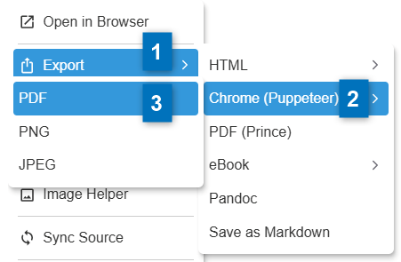

</div>
</div>

Cómo lo que hace es imprimir el HTML generado por el parser de Markdown Preview Enhanced, a través de Puppeteer. Muchas veces no controlamos los saltos de página y puede que el PDF no quede como esperamos.

### Añadir saltos de página al PDF

Para añadir saltos de página al PDF, podemos usar la etiqueta HTML:

```html
<div style="page-break-after:always;"></div>
```

Una forma sencilla de hacerlo es escribir **`mde_`** seguido de **`Ctrl + Space`** y seleccionar el snippet **`mde_saltoPagina`**. Esto nos insertará el siguiente código anterior.

Otro snippet que puede ser útil es **`mde_saltoPaginaLandscape`** que nos insertará el siguiente código:

```html
<div class="landscape" style="page-break-after:always;"></div>
```

que nos permitirá intercalar páginas en horizontal en el PDF. Para mostrar tablas grandes o imágenes grandes. Para ellos, deberemos seguir el siguiente esquema.

```html {highlight=[7-11]}

<p>Página 1 en vertical</p>

<div style="page-break-after:always;"></div>

<p>Página 2 en vertical</p>

<div class="landscape" style="page-break-after:always;">

<p>Página 3 en HORIZONTAL</p>

</div>

<p>Página 4 en vertical</p>

```

## Conclusiones

### Vantajas :+1:

* :heavy_check_mark: **Ideal para trabajo en equipo** o en grupo.
* :heavy_check_mark: Homogeneidad en la generación de contenido.
* :heavy_check_mark: Historial y revisión de cambios integrado.
* :heavy_check_mark: **Automatización** en la generación de documentos y despliegue.
* :heavy_check_mark: Permite bifurcaciones.
* :heavy_check_mark: Permite familiarizarse con tecnologías como MarkDown y Git (GitHub) para después aplicarlas con los alumnos en proyectos de grupo o transversales.

### Desventajas :-1:

* :x: Hacer maquetaciones complejas es '*costoso*'.
* :x: Requiere del manejo de varias herramientas y tecnologías.
* :x: Requiere de una estructura inicial '*compleja*'.
* :x: Tiene poco sentido si no se va a generar documentación técnica o se va a trabajar de forma individualizada.
* :x: Documentación '*pobre*' en ocasiones.
