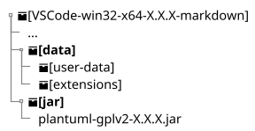

---
title:
    UD1 Título Reducido
date: 16/06/2021
export_on_save:
    puppeteer: true
    html: true
puppeteer:
    scale: 1
    landscape: false
    format: "A4"
    printBackground: true
    margin:
        top: "1cm"
        right: "1cm"
        bottom: "2.5cm"
        left: "1cm"
    displayHeaderFooter: true
    headerTemplate: "&nbsp;"
    footerTemplate: "
        <span style=\"font-size: 9pt; display: flex;\">
            <span class=\"pageNumber\" style=\"margin-left: 1cm;\"></span>
            /
            <span class=\"totalPages\"></span>
            <span class=\"title\" style=\"margin-left: 1cm;\"></span>
            <span style=\"margin-left: 1cm;\">Departamento de Informática IES Doctor Balmis</span>
        </span>
                    "
toc:
    depth_from: 1
    depth_to: 4
    ordered: false
---

# Apuntes {ignore=true}

[Descargar estos apuntes](./manual.pdf)

## Índice {ignore=true}

[TOC]

<div style=\"page-break-after:always;\"></div>

## Pre-Requisitos

1. Tener una **cuenta de GitHub**.
2. Tener instalado **Google Chrome** en el equipo.
3. Tener instalado **[Git](https://git-scm.com/download/win)** en local.
4. Tener el Java Runtime instalado mínimo la versión 17.
5. Tener instalado **[Visual Studio Code](https://code.visualstudio.com/)**- Puedes descargar la versión portable ya preparada de **[GDrive](https://drive.google.com/drive/u/0/folders/1LaryOjKFO4osOZkenHwuBcZ4U7rH1Gan)** en la carpeta del Departamento.

    Si ya lo tienes instalado puedes crearte un perfil personalizado de "***Apuntes con Markdown***" con las siguientes extensiones:

      * **Spanish Language Pack for VSCode** (para traducir el IDE al español)
      * **Code Spell Checker** (para detectar corrección ortográfica y sintáctica en  textos)
      * ***Spanish - Code Spell Checker*** (paquete de idioma español para el corrector ortográfico)
      * **Open in browser** (para abrir un archivo HTML en el navegador con botón derecho)
      * **Markdown All in One** (para trabajar con archivos markdown)
      * **Markdown Preview Enhanced** (para visualizar el archivo .md)
      * **markdownlint** (para comprobar el contenido del archivo)
      * **PlauntUML** (para mostrar colores en bloques de código de diagramas)
      * Visual Studio Keymap (para usar los atajos de teclado de Visual Studio)

### Esquema de carpetas tras la instalación

<div class="row">
<div class="col-sm-7">

En la capeta **`[data]`** está la configuración local del usuario de VSCode, en la carpeta **`[extensions]`** están las extensiones instaladas y en la carpeta descritas en el punto anterior y en la carpeta **`[user-data]`** está la configuración global del usuario de VSCode como pueden ser los snippets, temas, configuraciones de usuario, etc.

</div>
<div class="col-sm-5">



</div>
</div>

En la carpeta **`[jar]`** está el ejecutable de PlantUML que markdown-preview-enhanced utiliza para renderizar los diagramas, ya está preconfigurado en la instalación portable, pero para funcionar necesitarás tener el JRE de Java instalado como se comentaba anteriormente.

<div style="page-break-after:always;"></div>

## Creación o acceso al Workspace

Se ha creado una cuenta de GitHub para el departamento de informática del IES Doctor Balmis, para gestionar los repositorios con materiales para los módulos de Digitalización y Sosténibilidad. La cuenta es **`infor.materiales@iesdoctorbalmis.com`** y la clave de acceso es la usar de forma tradicional en el departamento para administración.

!!! warning Aviso
    Esta cuenta es solo para labores administrativas y no se debe usar para trabajos personales. Por lo que para acceder o clonar los repositorios de trabajo hay que usar la cuenta personar de GitHub y si no se tiene acceso a alguna organización dependiente de esta cuenta. Podemos usar esta cuenta para añadirnos como colaboradores en la mismas.

Tendremos 2 opciones:

1. Trabajar en algún proyecto ya existente en las organizaciones de GitHub para lo cual deberemos simplemente clonarlo. (Busca en Google cómo clonar un repositorio de GitHub).

2. (**Propuesta**) Partir de la plantilla de trabajo que se ha creado para el departamento. Para ello, deberemos seguir los siguientes pasos:

    1. **Si es la primera vez que trabajas con git**, deberás configurar tu nombre y correo electrónico. Para ello, puedes usar el siguiente comando en la terminal de Windows o Git Bash:

        ```cmd
        C:\materiales> git config --global user.name "Nombre Apellido"
        C:\materiales> git config --global user.email "cuenta@iesdoctorbalmis.com"
        ```

    2. En el siguiente **[repositorio público de GitHub](https://github.com/InforMaterialesBalmis/plantillamd)**, debes clonar el repositorio en tu equipo local. Pude que te pida autenticación de acceso a GitHub por lo que te aparecerá una atenticación inicial que te generará una credenciales de acceso desde tu equipo local. Para ello, puedes usar el siguiente comando en la terminal de Windows o Git Bash:

        ```cmd
        C:\materiales> git clone https://github.com/InforMaterialesBalmis/plantillamd.git
        ```

    3. Una vez clonado el repositorio, debes borrar la carpeta **`.git`** que se ha creado al clonar el repositorio. Para ello, puedes usar el siguiente comando en la terminal de Windows o Git Bash:

        ```cmd
        C:\materiales> cd plantillamd
        C:\materiales\plantillamd> del /s /q .git
        ```

    4. Crea un repositorio en tu cuenta de GitHub y vuelve a inicializar el repositorio en la carpeta clonada. Para ello, puedes usar el siguiente comando en la terminal de Windows o Git Bash:

        ```cmd
        C:\materiales\plantillamd> git init
        C:\materiales\plantillamd> git add .
        C:\materiales\plantillamd> git commit -m "Iniciando Materiales"
        C:\materiales\plantillamd> git remote add origin <URL_REPOSITORIO_GITHUB>
        C:\materiales\plantillamd> git push -u origin main
        ```

<div style="page-break-after:always;"></div>

## Trabajo básico con markdown

Dispones de la siguiente página con la documentación del Plugin en la **[página de Markdown Preview Enhanced](https://shd101wyy.github.io/markdown-preview-enhanced)**

Dispones de una guía básica de **[Markdown Básico](https://shd101wyy.github.io/markdown-preview-enhanced/#/markdown-basics)** en la misma página.

!!! Note Nota
    La extensión **markdownlint** te ayuda ha escribir markdown normalizado, pero como estamos usando una extensión, no es es muy importante salvo respetar los saltos de línea.
    En la carpeta **`.vscode/`** se han pre-definido varios code snippets (fragmentos de código) en en fichero **`FragmentosPernosalizados.code-snippets`**
    Para usarlos, una vez abierto un fichero con extensión markdown escribiremos **`mde_`** seguido de **`Ctrl + Space`** que es el (trigger suggestions) en mi KeyMap.

### Markdown básico

#### Encabezados

```markdown
# Título 1
## Título 2
### Título 3
...
```

#### Párrafos

Estándar en Markdown, solo hay que dejar una línea en blanco entre párrafos.

```markdown
Párrafo con una palabra en **negrita**
Párrafo con una palabra en *cursiva*
Párrafo con una palabra en ***negrita y cursiva***
Párrafo con una palabra en ~~tachado~~
Párrafo con una palabra en `código`
Párrafo con una palabra en **`código en negrita`**
Párrafo con una palabra en *`código en cursiva`*
Párrafo con una palabra en ***`código en negrita y cursiva`***

Los metacaracteres de Markdown son: `*`, `_`, `~`, `\` y `#` y 
deberás escaparlos con `\` si quieres que aparezcan en el texto.
```

!!! Note Nota
    Al tener el plugin "**Markdown All in One**" instalado, si selecciones una palabra y escribes un **\*** o **\`** se le añade el formato correspondiente a ambos lados de la selección y no sustituye el texto seleccionado.

#### Citas

En el estándar de Markdown, cada párrafo precedido del caracter **`>`** formará parte de la cita.

<div class="row">
<div class="col-sm-6 my-auto">

```markdown
> Un país, una civilización se puede juzgar  
> por la forma en que trata a sus animales.  
> — Mahatma Gandhi
```

</div>
<div class="col-sm-6 my-auto">

> Un país, una civilización se puede juzgar  
> por la forma en que trata a sus animales.  
> — Mahatma Gandhi

</div>
</div>

##### Citas fuera del stándar

También podremos definir una cita con las **[admonitions de Mkdocs](https://squidfunk.github.io/mkdocs-material/reference/admonitions/)**. Las tienes definidas como fragmentos de código con la raíz **`mde_cuadro_`** por tanto si pulsas **`mde_cuadro_`** seguido de **`Ctrl + Space`** te ofrecerá **`mde_cuadro_cita`** que te insertará el fragmento para citas.

<div class="row">
<div class="col-sm-6 my-auto">

```markdown
!!! Quote Cita
    Un país, una civilización se puede juzgar 
    por la forma en que trata a sus animales.  
    — Mahatma Gandhi
```

</div>
<div class="col-sm-6 my-auto">

!!! Quote Cita
    Un país, una civilización se puede juzgar
    por la forma en que trata a sus animales.  
    — Mahatma Gandhi

</div>
</div>

<div style="page-break-after:always;"></div>

Un poco más vistosas, las tienes definidas como fragmentos de código con **`mde_cita_HTML`** que generará lo siguiente:

```html
<div class="contenedor">
    <div class="fondo">
        <div class="abre_comilla">"</div>
        <div class="cierra_comilla">"</div>
        <div class="cita">Un país, una civilización se puede 
        juzgar por la forma en que trata a sus animales.</div>
        <div class="autor">- Mahatma Gandhi</div>
    </div>
</div>
```

<div class="contenedor">
    <div class="fondo">
        <div class="abre_comilla">"</div>
        <div class="cierra_comilla">"</div>
        <div class="cita">Un país, una civilización se puede juzgar 
        por la forma en que trata a sus animales.</div>
        <div class="autor">- Mahatma Gandhi</div>
    </div>
</div>

<div style="page-break-after:always;"></div>

### Listas

```markdown
* Elemento 1
* Elemento 2
  * Elemento 2.1 (alineado primera letra item padre)
    * Elemento 2.1.1
* Elemento 3
```

```markdown
1. Elemento 1
2. Elemento 2
   1. Elemento 2.1 (alineado primera letra item padre)
      1. Elemento 2.1.1antes)
3. Elemento 3
```

Respetar los espacios es muy importante para que cierto contenido pertenezca o no a un elemento de la lista.

<div class="row">
<div class="col-sm-6 my-auto">

```markdown
* Elemento 1
  Este párrafo pertenece al elemento 1
  * Conviene separar las listas indentadas
    Este párrafo pertenece al elemento 1.1
    Este párrafo pertenece al elemento 1.1

  Separa con un **salto de línea** para cotinuar
  en el nivel anterior
* Elemento 2
  Este párrafo pertenece al elemento 2
  Este párrafo pertenece al elemento 2

Este párrafo ya está fuera de la lista
```

</div>
<div class="col-sm-6 my-auto">

* Elemento 1
  Este párrafo pertenece al elemento 1
  * Conviene separar las listas indentadas
    Este párrafo pertenece al elemento 1.1
    Este párrafo pertenece al elemento 1.1

  Separa con un **salto de línea** para cotinuar
  en el nivel anterior
* Elemento 2
  Este párrafo pertenece al elemento 2
  Este párrafo pertenece al elemento 2

Este párrafo ya está fuera de la lista

</div>
</div>

### Tablas simples

<div class="row">
<div class="col-sm-6 my-auto">

```markdown
| Columna 1  | Columna 2  | Columna 3  |
| ---------- | ---------- | ---------- |
| Elemento 1 | Elemento 2 | Elemento 3 |
| Elemento 4 | Elemento 5 | Elemento 6 |
```

</div>
<div class="col-sm-6 my-auto">

| Columna 1  | Columna 2  | Columna 3  |
| ---------- | ---------- | ---------- |
| Elemento 1 | Elemento 2 | Elemento 3 |
| Elemento 4 | Elemento 5 | Elemento 6 |

</div>
</div>

> :bulb: **Tip:** Con **`Ctrl + K + D`** puedes hacer que la tabla se alienee correctamente.

<div style="page-break-after:always;"></div>

### Enlaces

1. Enlace normal por ejemplo a [Goole](http://www.google.com):

    ```markdown
    [Goole](http://www.google.com)
    ```

2. Enlace **negrita** por ejemplo a **[Goole](http://www.google.com)**:

    ```markdown
    **[Goole](http://www.google.com)**
    ```

3. Referencia directa <http://www.google.com>

    ```markdown
    <http://www.google.com>
    ```

### Imágenes

!!! Tip Tip
    Si usas VSCode y arrastras el archivo de imagen a la ventana del editor y justo antes de soltarla (drop) pulsas la tecla **`Shift`** te insertará la imagen en el formato correcto para Markdown.

#### Estándar imágenes básico

```markdown


{ width=200 }
{ height=100 }
```

Por ejemplo:

```markdown
{ width=300}
```

{ width=300}

#### Ampliación imágenes

Un poco más vistosas, las tienes definidas como fragmentos de código con **`mde_imagenCentrada`** que generará lo siguiente, donde controlamos el tamaño de la imagen y al tener el margen automático, se centra la imagen en la página.

```markdown
{ style="display:block; margin:0 auto; width:75%;max-width:300px;" }
```

{ style="display:block; margin:0 auto; width:75%;max-width:300px;" }

### Elementos especiales

Funciones matemáticas en línea $f(x) = x^2+3$

Con display en bloque:

$$f(x) = x^2+3$$

Código indicando el lenguaje a renderizar:

```csharp
string AYUDA = "csharp{.line-numbers} para numerar las líneas." +
            "csharp{highlight=2} para resaltar la línea 2" +
            "csharp{highlight=[2,5-7]} para resaltar la 2 y de la 5 a la 7" +
            "csharp{highlight=1; .line-numbers} para hacer ambas cosas";
```

Diagramas de Graphviz, PlantUML, Mermaid, etc.

```txt
    ```puml {align="center", style="zoom:1"}
    @startmindmap
    <style>
    mindmapDiagram {
        Linecolor black
        FontName Arial
        FontSize 14
        node {
                Padding 15
                Margin 15
                HorizontalAlignment center
                BackGroundColor white
            }
    }
    </style>

    *[#snow] Debian
    ** Ubuntu
    *** Linux Mint
    *** Kubuntu
    *** KDE Neon
    ** SteamOS

    @endmindmap
    ```
```


<div style="page-break-after:always;"></div>

Uso directo de HTML embebido con estilos definidos en el fichero importado justo después del frontmatter denominado **`EstilosPersonalizadosMarkdownEnhanced.less`**. Se puede utilizar para maquetaciones complejas.

```html
<div class="contenedor">
    <div class="fondo">
        <div class="abre_comilla">"</div>
        <div class="cierra_comilla">"</div>
        <div class="cita">Esto es una cita.</div>
        <div class="autor">- Aquí va el autor.</div>
    </div>
</div>
```

<div class="contenedor">
    <div class="fondo">
        <div class="abre_comilla">"</div>
        <div class="cierra_comilla">"</div>
        <div class="cita">Esto es una cita.</div>
        <div class="autor">- Aquí va el autor.</div>
    </div>
</div>

Importar código **renderizado al vuelo** a gráfico vectorial.

```txt
@import "assets//linux_kernel.dot" {align="center", style="zoom:0.4"}
```

@import "assets//linux_kernel.dot" {align="center", style="zoom:0.4"}

<div style="page-break-after:always;"></div>

## Flujo de trabajo y configuraciones

1. Trabajar en una rama con nuestro nombre y asegurarnos que trabajamos en ella.
2. (Opcional) Arrastrar el issue a la columna In Progress del Kanban.
3. Al finalizar la sesión:

   ```cmd
   git add . 
   git commit -m "mensaje"
   git push
   ```

4. Aquí puedo volver al punto 2 y seguir trabajando en el issue.
5. Al finalizar mi trabajo, inicio el proceso de Revisión/Integración.

   1. Ejecutar este Wroflow (está en **`posible_workflow_github.cmd`**).

        ```cmd
        git fetch origin
        git merge origin/main
        git push

        git checkout main
        git merge MI_RAMA
        git push
        git checkout MI_RAMA
        ```

   2. Crear un **Pull Request** al revisor/a/es.
      * Se solicitará de la rama con mi nombre sobre el Main o de mi fork sobre el repositorio original.
      * Se asignará revisor/a/es.
      * Una vez esté revisado 'mergeado' el pull request en la rama principal cerrar el issue y arrastrarlo a la columna Done del Kanban (opcional).

   3. Si solo queremos actualizarnos a como esté el main

        ```cmd
        git checkout main
        git pull
        git checkout MI_RAMA
        git merge main
        ```

   4. Una vez se ejecute el push en la rama main de GitHub se desencadenan las siguientes acciones en **`.github\workflows\publicar_web_action.yaml`**

        ```yaml
        # Al hacerse Push en master
        on:
        push:
            branches: [ main ]

        # Ejecuta este workflow secuencial (otro job se ejecutaría en paralelo)
        jobs:
        # Solo hay un trabajo llamado sincronizaA
        publica:
            # Se ejecuta en una máquina de ubuntu
            runs-on: ubuntu-latest

            # Secuencia de pasos
            steps:
            # Checks-out your repository under $GITHUB_WORKSPACE, so your job can access it
            - uses: actions/checkout@v4

            # Runs a set of commands using the runners shell
            # DEBO ELIMINAR CON rm AQUELLAS CARPETAS QUE NO QUIERO PUBLICAR !!!
            - name: Crea carpeta a publicar en www
                run: |
                rsync -av --prune-empty-dirs --include-from=rsync_files.txt ./ www/                 
                rm -Rv www/ejemplos
                rm -Rv www/.crossnote

            - name: Despliego www en el repo donde tengo github pages
                uses: peaceiris/actions-gh-pages@v3
                with:
                personal_token: ${{ secrets.DEPLOY_GH_KEY }}
                external_repository: ORGANIZACION/REPOPUBLICO.github.io
                publish_branch: main
                publish_dir: ./www
                allow_empty_commit: true
        ```

        Contenido de **`rsync_files.txt`** para que se publique solo lo necesario.

        ```txt
         + */
         + *.html
         + *.pdf
         + *.png
         + *.jpeg
         + *.jpg
         + *_ejemplo.cs
         + *_caso_de_estudio.zip
         + *.svg
         - *
        ```

<div style="page-break-after:always;"></div>

## Admonition

> :pushpin: **Nota:**
> 
> Para configurar **`secrets.DEPLOY_GH_KEY`**
> 1. Ir a https://github.com/settings/tokens y crear un token de acceso a tus repositorios.
> 2. Ir al repositorio de trabajo https://URLDeTuRepo/settings/secrets/actions y añadir un secreto llamado **`DEPLOY_GH_KEY`** con el token generado en el paso 1.

!!! note "Nota"
    Para configurar **`secrets.DEPLOY_GH_KEY`**
    1. Ir a

!!! warning "Advertencia"
    Para configurar **`secrets.DEPLOY_GH_KEY`**
    1. Ir a

<div style="display: flex; justify-content: space-evenly; align-items: center; margin-top: 15px; margin-bottom: 15px">
    
    
</div>


<div class="flotante", style="align-items: center;">
<div class="flotante_izq">

### Vantajas :+1: 

* :heavy_check_mark: **Ideal para trabajo en equipo** o en grupo.
* :heavy_check_mark: Homogeneidad en la generación de contenido.
* :heavy_check_mark: Historial y revisión de cambios integrado.
* :heavy_check_mark: **Automatización** en la generación de documentos y despliegue.
* :heavy_check_mark: Permite bifurcaciones.
* :heavy_check_mark: Permite familiarizarse con tecnologías como MarkDown y Git (GitHub) para después aplicarlas con los alumnos en proyectos de grupo o transversales

```puml {align="center"}
@startmindmap

scale 0.6

<style>
  mindmapDiagram {
    Linecolor black
    FontName Arial
    FontSize 14
    node {
            Padding 15
            Margin 15
            HorizontalAlignment center
            BackGroundColor white
         }
  }
</style>

*[#snow] Debian
** Ubuntu
*** Linux Mint
*** Kubuntu
*** KDE Neon
** SteamOS

@endmindmap
```

</div>
<div class="flotante_der">



</div>
</div>

Contrary to popular belief, Lorem Ipsum is not simply random text. It has roots in a piece of classical Latin literature from 45 BC, making it over 2000 years old. Richard McClintock, a Latin professor at Hampden-Sydney College in Virginia, looked up one of the more obscure Latin words, consectetur, from a Lorem Ipsum passage, and going through the cites of the word in classical literature, discovered the undoubtable source. Lorem Ipsum comes from sections 1.10.32 and 1.10.33 of "de Finibus Bonorum et Malorum" (The Extremes of Good and Evil) by Cicero, written in 45 BC. This book is a treatise on the theory of ethics, very popular during the Renaissance. The first line of Lorem Ipsum, "Lorem ipsum dolor sit amet..", comes from a line in section 1.10.32.


<div style="page-break-after:always;"></div>

## Conclusiones

### Vantajas :+1: 

* :heavy_check_mark: **Ideal para trabajo en equipo** o en grupo.
* :heavy_check_mark: Homogeneidad en la generación de contenido.
* :heavy_check_mark: Historial y revisión de cambios integrado.
* :heavy_check_mark: **Automatización** en la generación de documentos y despliegue.
* :heavy_check_mark: Permite bifurcaciones.
* :heavy_check_mark: Permite familiarizarse con tecnologías como MarkDown y Git (GitHub) para después aplicarlas con los alumnos en proyectos de grupo o transversales.

### Desventajas :-1: 

* :x: Hacer maquetaciones complejas es '*costoso*'.
* :x: Requiere del manejo de varias herramientas y tecnologías.
* :x: Requiere de una estructura inicial '*compleja*'.
* :x: Tiene poco sentido si no se va a generar documentación técnica o se va a trabajar de forma individualizada.
* :x: Documentación '*pobre*' ne ocasiones.
